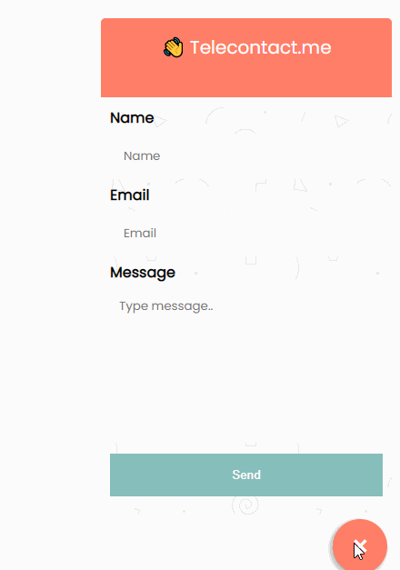

# Telefab

Telecontact.me floating action button plugin for websites.

## Usage

Available settings for your telefab.

- telefab-name -- Name of your formId
- telefab-id : Uniqe teleform HASH_ID for your form

// TODO customization attributes

- data-company: Header for FAB
- data-explanation: Header explanation
- data-main-color: Color of your header
- data-button-color: Send Button color for

```js
//Template
<script
  async src="https://www.telecontact.me/telefab.js"
  telefab-name={{NAME}}
  telefab-id={{HASH_ID}}
/>

// Example Usage
<script
  async src="https://www.telecontact.me/telefab.js"
  telefab-name="TestButton"
  telefab-id="W-lx1JJLMKb6"
/>
```

## Default


